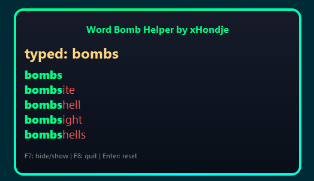

---

## About

WordBomb Typing Overlay is a helpful tool for the Roblox game **WordBomb**. It provides word suggestions as you type, with visual highlights and a subtle animation.  

The tool is built using **Python**, and is provided as a ready-to-use **EXE**.

---

## Download and Use

The easiest way to use the overlay is via the **exe**:

1. Go to the [Releases page](https://github.com/thijsvndmeer/Word-Bomb-Helper/releases).  
2. Download the latest `WordBombHelper.exe`.  
3. Double-click the exe to launch the overlay.  

> The overlay always stays on top of other windows and shows suggestions based on what you type.  
> - **F7:** hide/show overlay  
> - **F8:** quit  
> - **Enter:** reset typed buffer

---